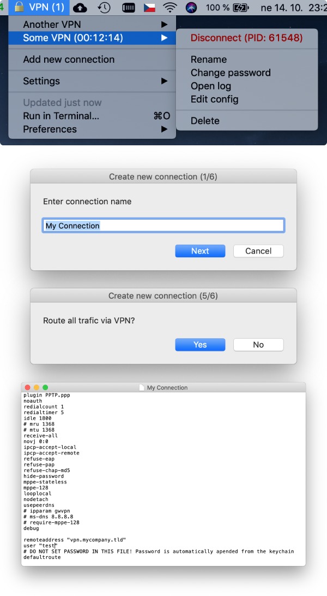

# bitbar-pptp-client

Simple PPPT client as the BitBar plugin.

Because Apple has removed support for PPTP from MacOS Sierra and newer and there is no free alternative solution that doesn't suck so I've decided to solve my problem this way.

## What this Plugin Can Do?

- Create a new simple PPTP connection with basic auth
- Store passwords in OSX keychain
- Rename connection
- Change password
- Edit configuration (PPTP configuration is stored in a plain text file so you can edit it manually to tweak the settings)
- View connection logs
- Delete connection

This plugin is just a wrapper around PPPD (Point to Point Protocol Daemon) which is still present in MacOS systems. The plugin runs the deamon providing it with a configuration file. Then it monitors its PID and terminates it when necessary.

For more information how to configure a PPTP connection, run `man pppd`.

**NOTE: The PPP deamon must be run under the root privileges so the plugin will ask you for you administrator password both when you will try to connect and disconnect.**

## Some Screenshots

## Behind the Scenes

The plugin saves all files in `~/.bitbar_pptp/` directory.

- Subdirectory `./peers` contains the PPPD configuration files
- Subdirectory `./logs` contains the PPPD log files
- Subdirectory `./run` contains special text files which store PPPD pid and last connection time

## License

The MIT License (MIT)

Copyright (c) 2018 Jiri Hybek <jiri@hybek.cz> (jiri.hybek.cz)

Permission is hereby granted, free of charge, to any person obtaining a copy of this software and associated documentation files (the "Software"), to deal in the Software without restriction, including without limitation the rights to use, copy, modify, merge, publish, distribute, sublicense, and/or sell copies of the Software, and to permit persons to whom the Software is furnished to do so, subject to the following conditions:

The above copyright notice and this permission notice shall be included in all copies or substantial portions of the Software.

THE SOFTWARE IS PROVIDED "AS IS", WITHOUT WARRANTY OF ANY KIND, EXPRESS OR IMPLIED, INCLUDING BUT NOT LIMITED TO THE WARRANTIES OF MERCHANTABILITY, FITNESS FOR A PARTICULAR PURPOSE AND NONINFRINGEMENT. IN NO EVENT SHALL THE AUTHORS OR COPYRIGHT HOLDERS BE LIABLE FOR ANY CLAIM, DAMAGES OR OTHER LIABILITY, WHETHER IN AN ACTION OF CONTRACT, TORT OR OTHERWISE, ARISING FROM, OUT OF OR IN CONNECTION WITH THE SOFTWARE OR THE USE OR OTHER DEALINGS IN THE SOFTWARE.